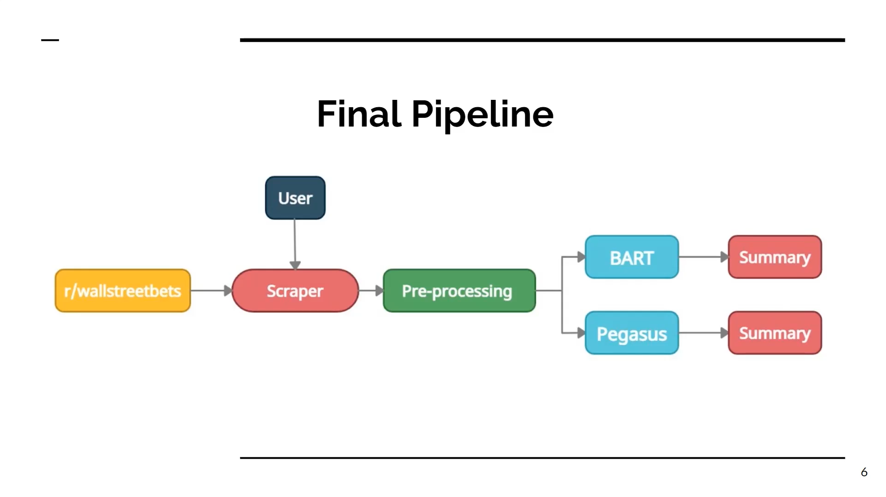
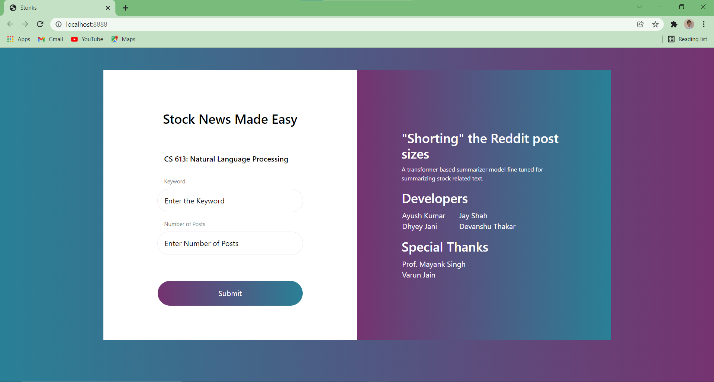
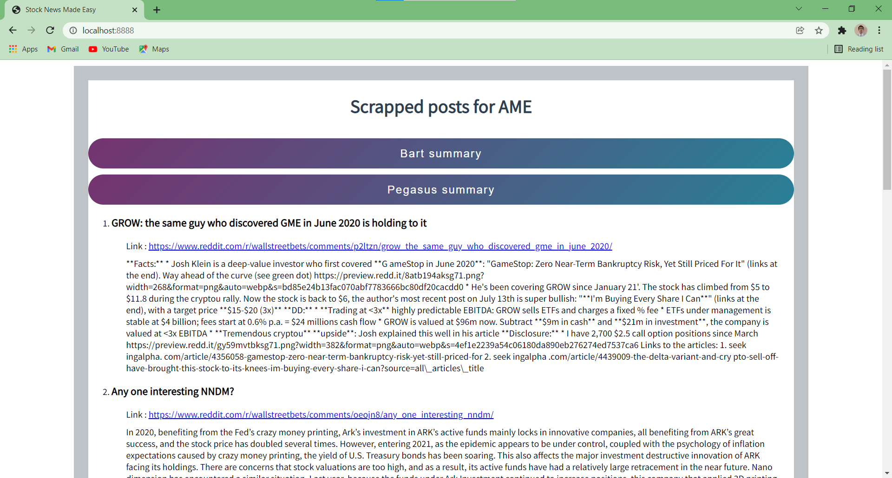
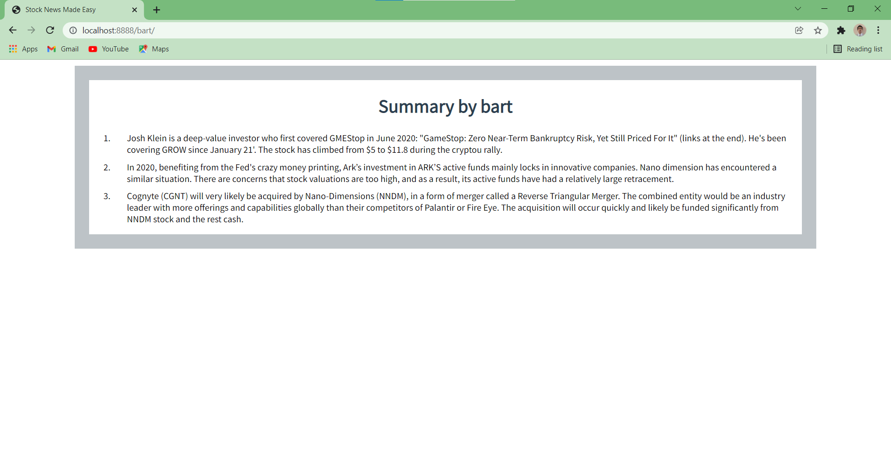
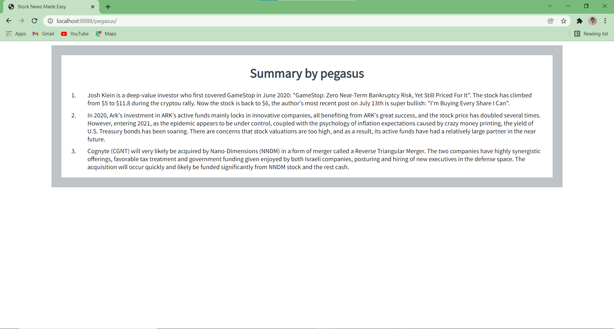

# Stock News Made Easy (NLP - Project) 
This repository contains the project of Natural Language Processing (NLP) course at IIT Gandhinagar offered by Prof. Mayank Singh during Fall semester 2021-22. In this project an application to scrape stock related posts in real time and generate their summaries was developed.

<b> Our Work </b>
* Manual summaries were curated for 400 posts from r/wallstreetbets subreddit. 
* Using that dataset we fine-tune SOTA summarization models of BART and Pegasus. We augment our dataset and further fine-tune our model. 
* Using fine-tuned models, a web-app to scrape and summarize posts from r/wallstreetbets was created.

The overall working pipeline of the Web-app is shown below 

 
  

## Demo of Web-app
* The user needs to enter a keyword and the number of posts. Our scrapper then scrapes latest post related to the keyword from r/wallstreetbets subbreddit and shows posts along with their title and link. In the image shown below the user had enter the keyword "AME" with number of posts=3. 
* To create teh web-app FAST-API has been used.
* To make scrapper, Python's Reddit API <b>PRAW</b> is used.

   
   

* The user can then choose any of the fine tuned model to get the summary of the scrapped posts. 

   
   

More details available in this <a href="https://drive.google.com/file/d/1nktD93b9pfsSqCtzEaYH_rODuvE63Tl-/view?usp=sharing">video</a>. 

## How to use web-app
* Download or clone this repository. Only main.py file and html, static directories are need for the web-app. Other files are for fine-tuning the model and curation of dataset. 
* The fine-tune model is available on request OR you can use your own summarization model. 
* Reddit PRAW's API credentials are hidden in the code files. Get your own Reddit API credentials wherever needed.

> ⚠️  **Remeber to change Reddit API credential varaiables with your own credential values.**
